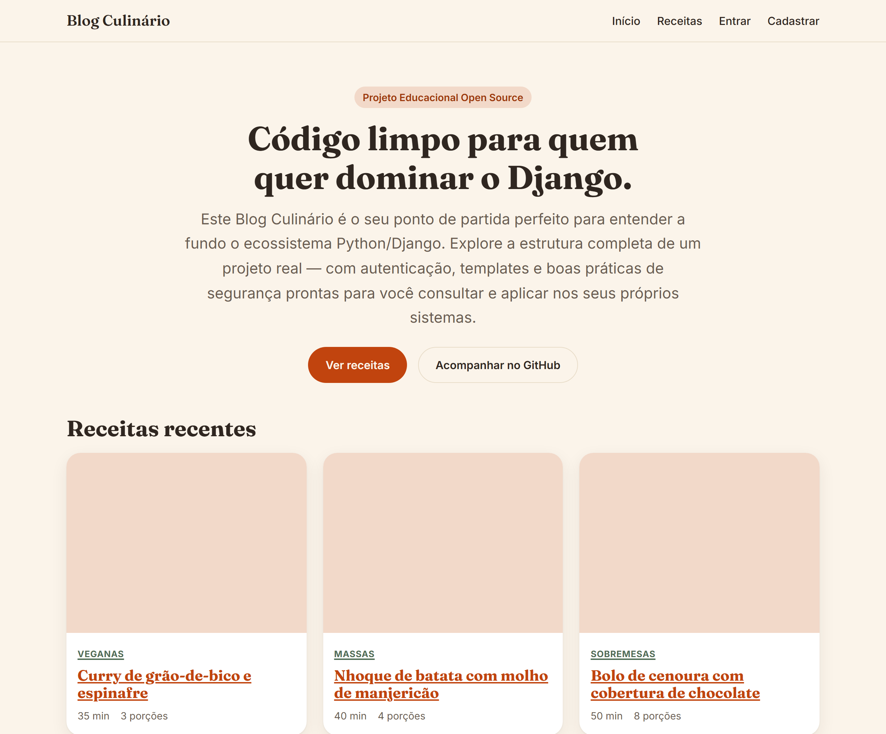

# 🍲 Blog Culinário | Blog Multipáginas Educacional em Django


[](https://github.com/ryanvmorais/django-blog-culinario/actions/workflows/ci.yml)


Este repositório contém um **blog culinário multipáginas** desenvolvido com o framework Django. Não é (só) um site de receitas — é uma referência para quem está aprendendo a construir uma aplicação web completa em Python, com **modelagem de domínio**, **autenticação nativa** e **segurança aplicada**, indo além do CRUD básico de tutorial.

### 🎯 Objetivo do Projeto:

Demonstrar como as peças de uma aplicação Django real se encaixam — modelagem, views, templates com herança, formulários, admin customizado, upload de imagem e segurança — em código que você pode ler de cima a baixo e entender o porquê de cada decisão, não só o "como".

---

### 📚 O que você vai encontrar neste projeto?

Este projeto foi estruturado para consolidar pilares fundamentais de engenharia de software:

* **Modelagem de Domínio:** relacionamentos reais entre `Receita`, `Categoria`, `Tag` e `Comentario`, com políticas explícitas de `on_delete` para cada um.
* **Dois Estilos de View:** baseadas em função (`nucleo`) e em classe (`receitas`), lado a lado, para comparar as duas abordagens.
* **Design System Próprio:** herança de templates (`base.html` + blocks) e CSS puro em `static/css/tokens.css`, sem framework de frontend nem build step.
* **Autenticação Nativa:** `django.contrib.auth` sem lib externa, com limite de tentativas de login por IP.
* **Segurança Aplicada:** honeypot e time-trap no formulário de comentário, validação de upload de imagem, segredos fora do código.
* **Qualidade Automatizada:** suíte de testes com `pytest` e um pipeline de CI que roda o mesmo portão de qualidade usado localmente.

---

### 🧠 Guia de Implementação (A Lógica por trás do Código):

Para quem está começando, o maior desafio não é decorar comandos do Django, mas entender a **montagem do raciocínio** de uma aplicação real. Confira os pilares da construção deste projeto:

1. **Apps por Domínio, não por Camada:** `nucleo` (institucional), `receitas` (o domínio principal) e `usuarios` (autenticação) — cada app cabe numa frase, o que facilita entender onde mexer.
2. **Configuração por Ambiente:** `settings/` é um pacote, não um arquivo só. `base.py` tem o que nunca muda; `dev.py` e `prod.py` só sobrescrevem o que é específico do ambiente — o padrão que evita o clássico "esqueci de trocar DEBUG antes do deploy".
3. **Banco de Dados de Propósito:** SQLite não por preguiça, mas por decisão — zero configuração para quem clona o repo, já que o objetivo é aprender Django, não administrar um banco.
4. **Identidade Visual do Zero:** um design system pequeno em `static/css/tokens.css` (cores, tipografia, espaçamento como variáveis CSS) mantém o projeto 100% focado em Python, sem esconder como um front-end é montado.
5. **Segurança em Camadas:** limite de tentativas por IP (login e comentário) e honeypot + time-trap no formulário de comentário — implementados a partir de achados de uma auditoria de segurança real, não especulação.
6. **Desenvolvimento Guiado por Spec:** cada funcionalidade nova nasce em `specs/` antes do código — requisitos, design e tarefas, com aprovação antes de avançar de fase.

---

### 🛠️ Tecnologias e Ferramentas:

Para garantir a melhor experiência de aprendizado e a execução correta de todos os recursos, o projeto utiliza as seguintes tecnologias:

| Ferramenta | Descrição | Badge |
| :--- | :--- | :--- |
| **Python 3.14** | Linguagem base do projeto. |  |
| **Django 6.1** | Framework web "com baterias incluídas" para toda a lógica, ORM e admin. |  |
| **SQLite** | Banco de dados relacional — um arquivo, zero configuração. |  |
| **uv** | Gerenciador de dependências e ambientes virtuais, com lockfile reprodutível. |  |
| **Pillow** | Processa e valida as imagens de capa das receitas. |  |
| **django-environ** | Lê `SECRET_KEY`/`DEBUG` do ambiente em vez de deixá-los no código. |  |
| **WhiteNoise** | Serve os arquivos estáticos em produção sem precisar de Nginx/CDN. |  |
| **Ruff / Black / Mypy** | Lint, formatação e checagem de tipos — o portão de qualidade antes de cada commit. |  |
| **Pytest** | Framework de testes para garantir a integridade de cada funcionalidade. |  |

Para o porquê de cada escolha (e as alternativas descartadas), veja [docs/stack.md](docs/stack.md).

---

### ⚙️ Como rodar o projeto localmente:

1.  **Clone o repositório:**
    ```bash
    git clone https://github.com/ryanvmorais/django-blog-culinario.git
    cd django-blog-culinario
    ```
2.  **Instale as dependências** (o projeto usa [uv](https://docs.astral.sh/uv/), que cria e gerencia o ambiente virtual automaticamente):
    ```bash
    uv sync
    ```
3.  **Execute as migrações e o servidor:**
    ```bash
    uv run python manage.py migrate
    uv run python manage.py runserver
    ```

Acesse `http://127.0.0.1:8000/`. Não é preciso configurar nenhuma variável de ambiente para rodar localmente — veja `.env.example` se quiser customizar algo.

> ⚠️ **Nota sobre o Admin:** quer um usuário para acessar `/admin/`? Rode
> `uv run python manage.py createsuperuser` e siga as instruções no terminal.

---

### Qualidade e testes

O projeto roda uma suíte de testes automatizados (`pytest`) e um portão de
qualidade antes de qualquer commit:

```bash
uv run ruff check .      # lint + ordem de imports
uv run black --check .   # formatação
uv run mypy .             # checagem de tipos
uv run pytest             # testes
```

O mesmo portão roda automaticamente em CI (`.github/workflows/ci.yml`) a cada
push/PR. Para o mapa de cada tecnologia da stack (o que é, por que foi
escolhida, o que estudar), veja [docs/stack.md](docs/stack.md); para as
especificações de cada funcionalidade, veja [specs/](specs/); para o
detalhamento de arquitetura e convenções, veja [CLAUDE.md](CLAUDE.md).

---

### 📋 Atividades para praticar (Desafios de Evolução):

Para exercitar o que você aprendeu e dominar o Django, tente implementar estas novas funcionalidades:

1. **🔍 Filtro por Tempo de Preparo:** adicione um campo `tempo_de_preparo` filtrável na listagem de receitas.
   * **O Aprendizado:** `QuerySet.filter()` combinado com um formulário de busca.
2. **🎲 Receita Aleatória:** crie uma rota que leve a uma receita publicada escolhida ao acaso.
   * **O Aprendizado:** `order_by("?")` do Django e os limites de performance dessa abordagem num banco maior.
3. **💬 Paginação de Comentários:** pagine os comentários de uma receita com muitos comentários.
   * **O Aprendizado:** o `Paginator` aplicado a um queryset relacionado (não à página inteira), e como ajustar o template para paginar só uma seção.
4. **🐘 Troca de Banco de Dados:** troque o SQLite por PostgreSQL num ambiente separado.
   * **O Aprendizado:** como `DATABASES` isola o projeto do banco físico — o resto do código não muda uma linha.

---

### 💡 Ficou com alguma dúvida ou tem sugestões?

Encontrou algo que poderia estar mais didático, teve dificuldade com alguma configuração, ou pensou numa melhoria que tornaria este projeto ainda mais útil como referência? Estou aqui para ajudar!

*   **Abra uma [Issue](https://github.com/ryanvmorais/django-blog-culinario/issues):** essa é a melhor forma de construirmos um material de referência sólido para a comunidade e ajudarmos outros desenvolvedores que possam ter a mesma dúvida.

Veja [CONTRIBUTING.md](CONTRIBUTING.md) para o passo a passo de como contribuir.

---

### ⚖️ Licença

Este projeto está sob a **Licença MIT**. Isso significa que você pode usar, copiar e modificar o código à vontade, inclusive para os seus próprios projetos. Para mais detalhes, consulte o arquivo [LICENSE](LICENSE).
